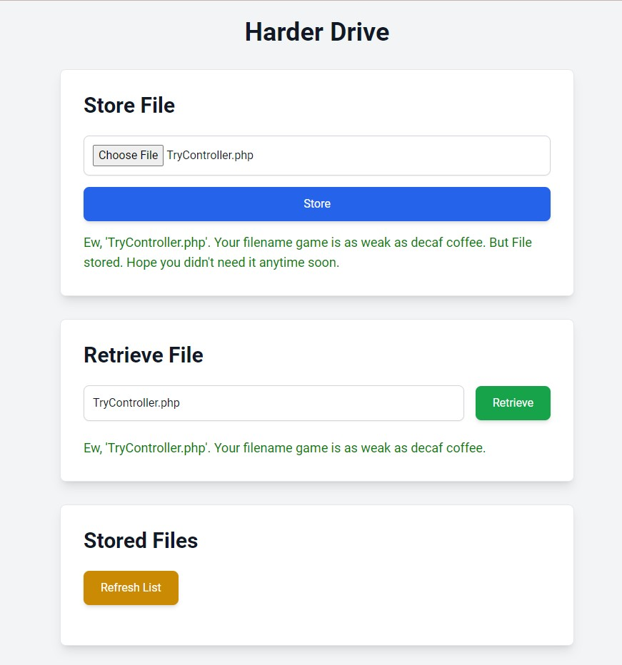

# Harder Drive : A Delightfully Absurd File Storage Simulation

Welcome to the Harder Drive Project! 🚀

This project is a whimsical file storage simulation designed to make your tech life more entertaining. With this project, you'll experience file storage with a twist:

## Features
- **Randomly Refuses to Store Files**: Because clearly, your files aren’t that important.
- **Sarcastic Error Messages**: Get judged by your file system with every operation.
- **Initiates Conversations**: Engage in deep, philosophical discussions about your file storage choices.
- **File Encryption/Decryption**: Because hiding secrets is just so much fun.

## Why Use It?
Honestly, I needed to refresh my mind about Python and dive back into coding with a project that’s both challenging and delightfully absurd. Plus, everyone needs a file system that makes them chuckle.

## Installation
1. Clone the repository: `git clone https://github.com/JonathanKevin16/harder_drive.git`
2. Navigate to the project directory: 
3. Install dependencies: `pip install -r requirements.txt`

## Usage
1. Run the web application: `python web_app.py`
2. Access the web interface at `http://localhost:5000`

Enjoy the Harder Drive experience, where file storage meets comedy!
